# Intro to Git and Github

This is the companion notes to the slides in this repo

Outline
- Install git and create a Github account
- What is Git
- Basic Bash Commands
- Using Git
- Using Github
- Advanced Workflows
    - Branching and Merging
    - Pull Requests
    - Merge Conflicts
    - Undoing local changes
    - Collaborating with other poeple
- Quality of Life Hacks

# Install Git and Create a Github Account

## Installing Git:
- Linux:  sudo apt-get install git
- Mac:  http://git-scm.com/download/mac (probably already installed)
- Windows: http://git-scm.com/download/win 

If you are using Windows, you will be interacting with Git via the Git Bash
application 

If you are using Mac OS or Linux, use the terminal. Ensure that you can run `git
--version` without any errors.

## Setting up Git


Run the following commands:

```console
git config --global user.name <your name>
git config --global user.email <your email address>
git config --global --add color.ui true
git config --list
```
Replace `<your name` and `your email address as appropiate`.

## Create a Github Account

- Github is a code hosting platform for version control and collaboration
- Share code and collaborate on coding projects
- Create a free account at www.github.com

## Text Editor

Recommended editors (non-exhaustive)
- Sublime Text: https://www.sublimetext.com
- VSCode: https://code.visualstudio.com

# Basic Bash Commands

Here are some common and useful bash commands, most of which deal with file and
directory manipulation:
- `ls`: Show directory contents, lists names of files.
    - `ls -la`: Show directory contents (hidden files included) with extra info 
- `mkdir`: Creates a directory of the specified name.
    - `mkdir foo` creates a directory called "foo".
- `cat`: Display contents of a file.
    - `cat hello.txt`: display contents of `hello.txt`  
- `cd`: Change directory. Change to certain directory name if provided.
    - `cd foo` takes you to the directory foo.
    - `cd` Changes to home directory if no directory specified.
    - `cd ..` takes you up one directory
    - `cd ../..` to go up tw
- `pwd`: Displays the name of the working directory.
- `touch`: Creates a blank file with a specified name.
    - `touch file.txt`: Creates blank file with name `file.txt`
- `less`: View contents of specified file, page by page.
    - `less <filenname>`
- `head`/tail: Displays the first/ last 10 lines of a file.
    - `head <filename>`
- `rm`: Removes a specified file. This action is PERMANENT. There is no recycle
  bin.
    - `rm <filename>`: remove file
    - `rm -r <folder>`: remove folder
- `rmdir`: Removes a directory.
- `history`: Display a listing of the last commands you've run.
- `cp`: Copy specified file to a new named file. Use -r flag to copy a
  directory.
    - `cp file1.txt file_copy.txt` copy `file1.txt` and paste as `file_copy.txt`
- `mv`: Rename a specified file or directory.
    - `mv foo.txt bar.txt` renames `foo.txt` as `bar.txt`
- `Ctrl-c`: cancel everything (use this when in doubt)

To learn more:
https://www.unr.edu/research-computing/the-grid/using-the-grid/bash-commands

# Using Git

## Key Concepts

- **Repositories**: Collection of all the files and history of these files
    - contains all commits 
    - 1 Repo <=> 1 Project
    - Can live on a local machine or on a remote server (e.g. Github)
    - Often shortened to repo
- Commit : record of files that you have changed since last commit
    - To add a file to a commit, you need to add it to the staging environment:
    - `git add <filename>`
- Staging Environment: (or index) tracks changes that you want to commit
    - After using the git add command to add all the files you want, package
      them into a commit with the git commit command

## Commits and the Staging Environment


Working in Git is all about commitments. When you save a file in your editor or
create a new file, you move it to the *cardboard box*. 

When you are feeling more confident about your changes, you move them to the the
*wooden box*. This happens when you run the `git add <filename>` command. 

Once you are ready to commit, you tend move it to the **safe**, once in there
becomes the history of the repo. This happens when you run the `git commit`
command.

## How does a Git project look like?


- HEAD: a reference to the last commit in the currently checked-out branch
- MASTER: (traditionally) the main branch in your project
- Branch: pointer to some commit 
- Stage (cache): where you place files to commit to the git repo (wooden box)
- Working Directory: current local directory that you are working on (cardboard
  box)

## Quick Example

To help readers follow along with the examples, the shell session is provided
below. 

```console
bash-3.2$ mkdir myproject
bash-3.2$ cd myproject
bash-3.2$ touch myfile.txt
# List files in myproject folder
bash-3.2$ ls
myfile.txt
```
Anything after the `$` is a command that you should type. Any line that does not
start with `$` is terminal output. Any line that starts with `#` is a comment
and should not entered into the terminal. It is for explaining stuff.

### Step 1: Create a local git repo

```console
bash-3.2$ cd Desktop/
bash-3.2$ mkdir myproject
bash-3.2$ cd myproject/
bash-3.2$ git init
Initialized empty Git repository in /Users/raynoldng/Desktop/myproject/.git/
```

Check the status of the repo with `git status`

### Step 2: Add a new file 

```console
bash-3.2$ touch raynold.txt
bash-3.2$ ls
raynold.txt
```

Check the status of the repo:

```console
bash-3.2$ git status
On branch master

No commits yet

Untracked files:
  (use "git add <file>..." to include in what will be committed)

	raynold.txt

nothing added to commit but untracked files present (use "git add" to track)
```

This means that `raynold.txt` is in the cardboard box.

### Step 3: Add file to staging environment / wooden box

```console
bash-3.2$ git add raynold.txt
bash-3.2$ git status
On branch master

No commits yet

Changes to be committed:
  (use "git rm --cached <file>..." to unstage)

	new file:   raynold.txt

```

You can also use `git add .` to add all files with one command

### Step 4: Create a commit / moving to steel safe

```console
bash-3.2$ git commit -m 'This is my first commit'
[master (root-commit) 918dfdd] This is my first commit
 1 file changed, 0 insertions(+), 0 deletions(-)
 create mode 100644 raynold.txt
```

`-m` is the message parameter and you supply the commit message after it. If you
were to run `git commit`, your terminal will launch an editor which displays a
summary of the changes in the commit and you can enter the commit message. 

## File Status Lifecycle

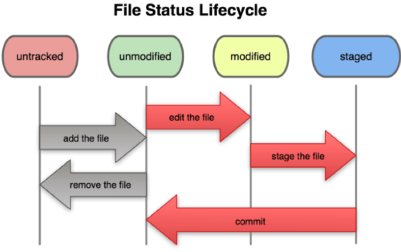

## Quck Exercise

1. Add a few more lines to your_name.txt and commit the change 
2. Create a new file, add some text and commit that change 
3. The git add <filename> command adds the file to staging, how to undo that?
   (Hint: study the output of git status)

# Github

What is Github? 
- Largest web-based git repository hosting service. Hosts remote repositories
- Allows for code collaboration with anyone online
- Additional functionality on top of git
    - UI, documentation, issues, pull requests/review and more

## Uploading your project on Github

### Step 5: Create a new Github repo

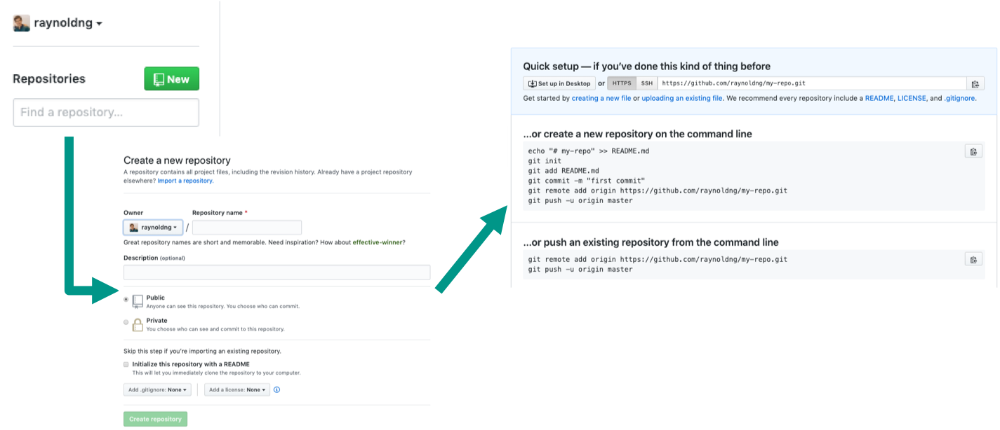

### Step 6: Push Master Branch to your Repo

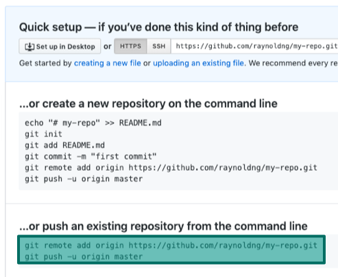

```console
bash-3.2$ git remote add origin https://github.com/raynoldng/my-repo.git
bash-3.2$ git push -u origin master
# Username and Password prompt
Enumerating objects: 3, done.
Counting objects: 100% (3/3), done.
Writing objects: 100% (3/3), 226 bytes | 226.00 KiB/s, done.
Total 3 (delta 0), reused 0 (delta 0)
To https://github.com/raynoldng/my-repo.git
 * [new branch]      master -> master
Branch 'master' set up to track remote branch 'master' from 'origin'.
```

Refresh your Github repo and see your uploaded code!

## Remotes

- Remote: common repository that all team members use to exchange their changes
- Usually stored on a code hosting service like Github or an internal server
- `git remote –v` : list the remote connections that you have to other repositories
- `git remote add <name> <url>` : create a new connection to a remote repo
- `git remote rm <name>` : remove a remote
- `git remote rename~ <old-name> <new-name>` : rename a remote

## Pushing and Pulling

- Pulling: downloading commits that don’t exist on your machine from a remote repository
- Pushing: adding your local changes to the remote repository
- Fetch: download changes but do not merge it in yet

# Advanced Workflows

If you made it this far you are more or less able to effectively use git and
Github for personal projects! \o/

Lets now move on to more advanced workflows.

## Branching and Merging 

- Branching: diverge from main line of development and continue to work without messing that main line
- master: main branch in a project
- merging: Once you are done with your line of work, you merge it back into master

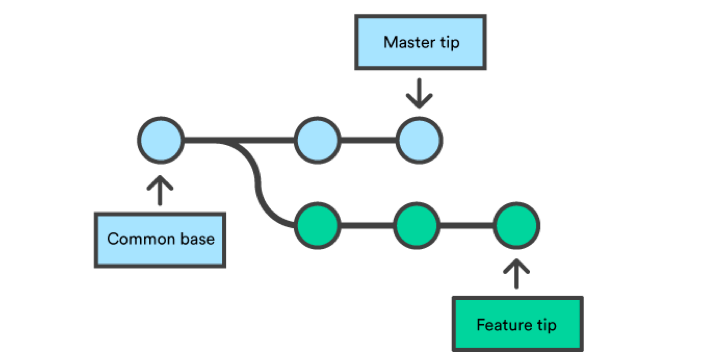
*A branch diverges from the orignal branch*
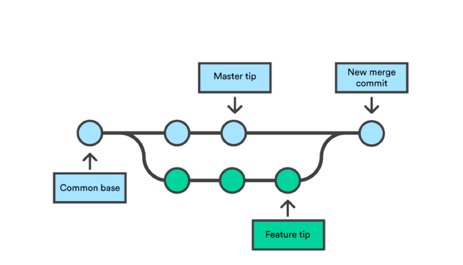
*Once feature is done, you can merge it back into master*

### Step 7: Create a new branch

To create a new branch: `git checkout -b <branch name>`

```console
bash-3.2$ git branch | cat
* master
bash-3.2$ git checkout -b test
Switched to a new branch 'test'
bash-3.2$ git branch | cat
  master
* test
```
### Step 8: Save changes to new branch

After making changes to `raynold.txt`

```console
bash-3.2$ git add raynold.txt
bash-3.2$ git status
On branch test
Changes to be committed:
  (use "git reset HEAD <file>..." to unstage)

	modified:   raynold.txt

bash-3.2$ git commit -m 'made changes to raynold.txt'
[test 952a793] made changes to raynold.txt
 1 file changed, 1 insertion(+)
```

### Step 9 (ver 1): Merge changes into master

- Need to checkout to branch that we are going to merge the branch into
- If there is no changes on the master (current) since the branch out, we can do
  a fast forward merge
- To push changes to a new branch on github: `git push origin <branch name>`
- `origin`: shorthand for the remote repository URL

```console
bash-32.$ git checkout master
Switched to branch 'master'
Your branch is up to date with 'origin/master'.
bash-32.$ git merge test
Updating 918dfdd..f4b6e4f
Fast-forward
 raynold.txt | 1 +
 1 file changed, 1 insertion(+)
```

git does a fast forward when you merge a branch that is ahead of your
checked-out branch [1].

## Creating a Pull Request

About Pull Requests
- To tell others about changes that you’ve pushed to a branch in a repo on Github
- After you open a PR, you can discuss and review the potential changes with
  collaborators and add follow-up comments before are merged into the base
  branch

### Step 9 (Ver 2): Push changes to a remote branch

Create a branch and commit some changes to it.

```
bash-3.2$ git status
On branch my-branch
Changes not staged for commit:
  (use "git add <file>..." to update what will be committed)
  (use "git checkout -- <file>..." to discard changes in working directory)

	modified:   raynold.txt

no changes added to commit (use "git add" and/or "git commit -a")
bash-3.2$ git add raynold.txt
bash-3.2$ git status
On branch my-branch
Changes to be committed:
  (use "git reset HEAD <file>..." to unstage)

	modified:   raynold.txt

bash-3.2$ git commit 'add more lines'
error: pathspec 'add more lines' did not match any file(s) known to git
bash-3.2$ git push origin my-branch
Total 0 (delta 0), reused 0 (delta 0)
remote:
remote: Create a pull request for 'my-branch' on GitHub by visiting:
remote:      https://github.com/raynoldng/my-repo/pull/new/my-branch
remote:
To https://github.com/raynoldng/my-repo.git
 * [new branch]      my-branch -> my-branch
```

You can now see your new branch on Github:
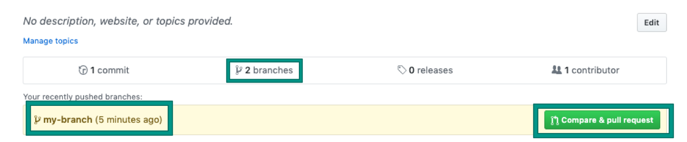

Let's see how to create a pull request and how that leads to a merge

### Step 10: Create and approve your Pull Request

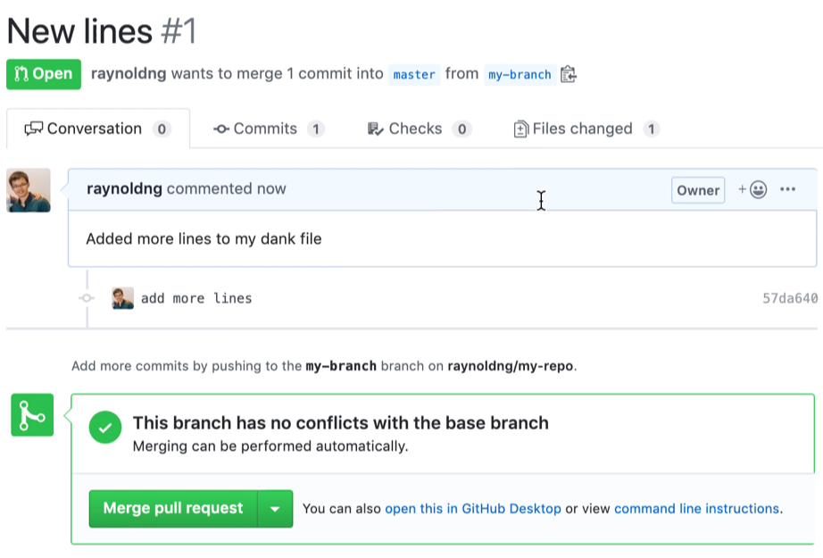

Click on merge pull request. Can look into the other options in your free time.

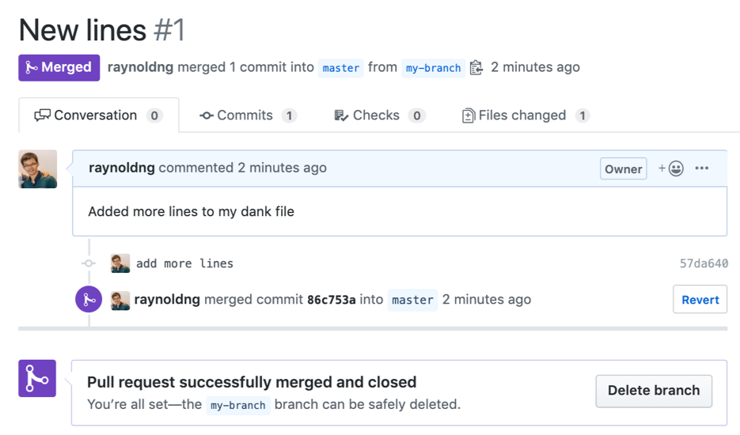

You can see that the branch has been merged in your Github repo:

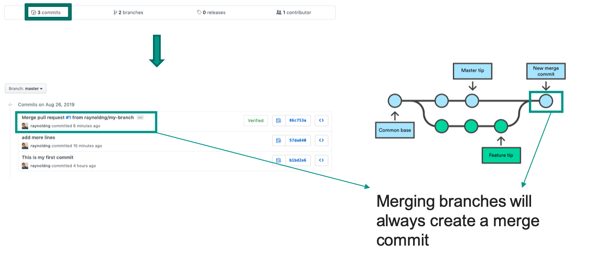

Note that in this case a merge commit was created even though we could have fast forwarded.
See [Gtihub Docs](https://help.github.com/en/articles/merging-a-pull-request)
for more info.

### Step 11: Get changes back on your computer

```console
bash-3.2$ git checkout master
Switched to branch 'master'
Your branch is up to date with 'origin/master'.
bash-3.2$ git pull
remote: Enumerating objects: 1, done.
remote: Counting objects: 100% (1/1), done.
remote: Total 1 (delta 0), reused 0 (delta 0), pack-reused 0
Unpacking objects: 100% (1/1), done.
From https://github.com/raynoldng/my-repo
   918dfdd..182e7f7  master     -> origin/master
Updating 918dfdd..182e7f7
Fast-forward
 raynold.txt | 1 +
 1 file changed, 1 insertion(+)
```

### Checkouts

- Act of switching between different versions of the target entity
- `git checkout <branch name/commit>`
- `git checkout -b <new branch name>` : create a new branch
- `git checkout <branch/commit> <filename>` : restore previous version of file

## Merge Conflicts

Merge conflicts happen when you merge branches that have competing commits, and Git needs your help to decide which changes to incorporate in the final merge

### Conflict Free Merge

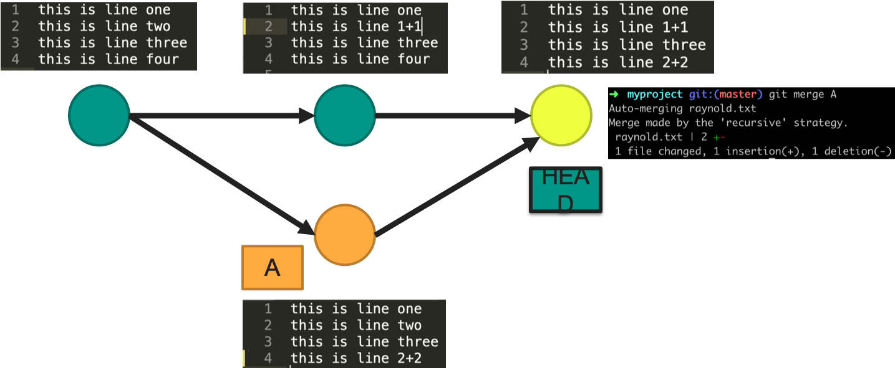

### Merge Conflict

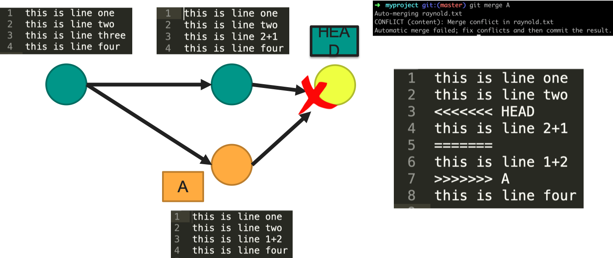

To resolve a merge conflict, you must manually edit the conflicted file to
select the changes that you want to keep in the final merge. 

Search your repo for conflict markers `<<<<<<<`. 

```
<<<<<<< HEAD
Changes from your head branch
=======
Changes from the other branch (incoming branch)
>>>>>>> branch-a
```

Most IDEs will have tools that help resolve conflicts

## Undoing local changes

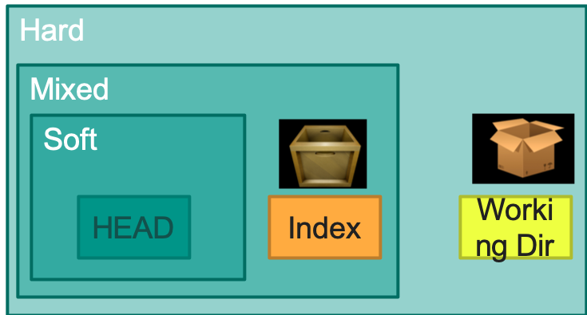
*Scope of changes (e.g. Soft: index and working dir unchanged)*

### Soft Resets

- Rewinds repo to specified commit
- Left out commits are orphaned and REMOVED next time git performs garbage collection
- `git reset HEAD~1` : go back one commit
- `git reset HEAD~2` : go back two commits

### Hard Resets (oof)

- When things go so wrong and you don’t even want to salvage it
- Removes ALL TRACES of your changes
- `git reset --hard HEAD`: undoes all changes since last commit

## Forking Repos

When you want to contribute to a github repo or use it as your starting point

1. Fork repo
2. Clone the forked repo
3. Make and push changes
4. Make Pull Request


### Final Activity: Making your first public PR

1. Go to https://github.com/raynoldng/my-repo
2. ⭐ it 
3. Fork it (you will be redirected to your new repo page)
4. Clone into your local machine
5. Create a new branch `<your_name>`
6. Add a new file `<your_name>.txt` and add some text in it
7. Commit your changes and push it
8. Make the PR request, I will approve it
9. Profit


References
[1]: https://confluence.atlassian.com/bitbucket/git-fast-forwards-and-branch-management-329977726.html