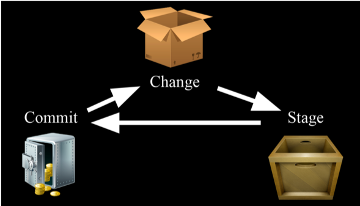
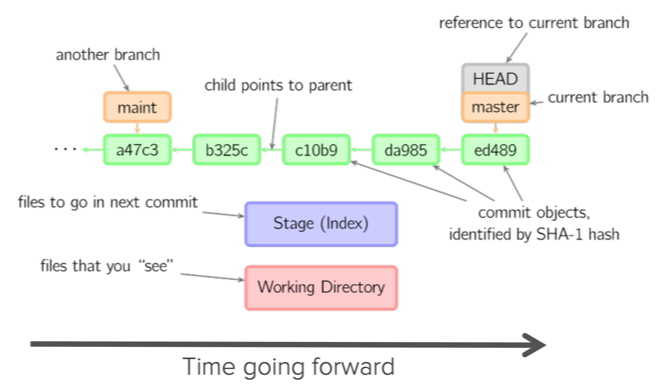

# Intro to Git and Github

This is the companion notes to the slides. Sometimes it is better for the all of
the information in one neat document.

Outline
- Install git and create a Github account
- What is Git
- Basic Bash Commands
- Using Git
- Using Github
- Advanced Workflows
    - Branching and Merging
    - Pull Requests
    - Merge Conflicts
    - Undoing local changes
    - Time travelling
- Quality of Life Hacks

# Install Git and Create a Github Account

## Installing Git:
- Linux:  sudo apt-get install git
- Mac:  http://git-scm.com/download/mac (probably already installed)
- Windows: http://git-scm.com/download/win 

If you are using Windows, you will be interacting with Git via the Git Bash
application 

If you are using Mac OS or Linux, use the terminal. Ensure that you can run `git
--version` without any errors.

## Setting up Git


Run the following commands:

```console
git config --global user.name <your name>
git config --global user.email <your email address>
git config --global --add color.ui true
git config --list
```
Replace `<your name` and `your email address as appropiate`.

## Create a Github Account

- Github is a code hosting platform for version control and collaboration
- Share code and collaborate on coding projects
- Create a free account at www.github.com

## Text Editor

Recommended editors (non-exhaustive)
- Sublime Text: https://www.sublimetext.com
- VSCode: https://code.visualstudio.com

# Basic Bash Commands

Here are some common and useful bash commands, most of which deal with file and
directory manipulation:
- `ls`: Show directory contents, lists names of files.
    - `ls -la`: Show directory contents (hidden files included) with extra info 
- `mkdir`: Creates a directory of the specified name.
    - `mkdir foo` creates a directory called "foo".
- `cat`: Display contents of a file.
    - `cat hello.txt`: display contents of `hello.txt`  
- `cd`: Change directory. Change to certain directory name if provided.
    - `cd foo` takes you to the directory foo.
    - `cd` Changes to home directory if no directory specified.
    - `cd ..` takes you up one directory
    - `cd ../..` to go up tw
- `pwd`: Displays the name of the working directory.
- `touch`: Creates a blank file with a specified name.
    - `touch file.txt`: Creates blank file with name `file.txt`
- `less`: View contents of specified file, page by page.
    - `less <filenname>`
- `head`/tail: Displays the first/ last 10 lines of a file.
    - `head <filename>`
- `rm`: Removes a specified file. This action is PERMANENT. There is no recycle
  bin.
    - `rm <filename>`: remove file
    - `rm -r <folder>`: remove folder
- `rmdir`: Removes a directory.
- `history`: Display a listing of the last commands you've run.
- `cp`: Copy specified file to a new named file. Use -r flag to copy a
  directory.
    - `cp file1.txt file_copy.txt` copy `file1.txt` and paste as `file_copy.txt`
- `mv`: Rename a specified file or directory.
    - `mv foo.txt bar.txt` renames `foo.txt` as `bar.txt`
- `Ctrl-c`: cancel everything (use this when in doubt)

To learn more:
https://www.unr.edu/research-computing/the-grid/using-the-grid/bash-commands

# Using Git

## Key Concepts

- **Repositories**: Collection of all the files and history of these files
    - contains all commits 
    - 1 Repo <=> 1 Project
    - Can live on a local machine or on a remote server (e.g. Github)
    - Often shortened to repo
- Commit : record of files that you have changed since last commit
    - To add a file to a commit, you need to add it to the staging environment:
    - `git add <filename>`
- Staging Environment: (or index) tracks changes that you want to commit
    - After using the git add command to add all the files you want, package
      them into a commit with the git commit command

## Commits and the Staging Environment



Working in Git is all about commitments. When you save a file in your editor or
create a new file, you move it to the *cardboard box*. 

When you are feeling more confident about your changes, you move them to the the
*wooden box*. This happens when you run the `git add <filename>` command. 

Once you are ready to commit, you tend move it to the **safe**, once in there
becomes the history of the repo. This happens when you run the `git commit`
command.

## How does a Git project look like?



- HEAD: a reference to the last commit in the currently checked-out branch
- MASTER: (traditionally) the main branch in your project
- Branch: pointer to some commit 
- Stage (cache): where you place files to commit to the git repo (wooden box)
- Working Directory: current local directory that you are working on (cardboard
  box)

## Quick Example

To help readers follow along with the examples, the shell session is provided
below. 

```console
bash-3.2$ mkdir myproject
bash-3.2$ cd myproject
bash-3.2$ touch myfile.txt
# List files in myproject folder
bash-3.2$ ls
myfile.txt
```
Anything after the `$` is a command that you should type. Any line that does not
start with `$` is terminal output. Any line that starts with `#` is a comment
and should not entered into the terminal. It is for explaining stuff.

### Step 1: Create a local git repo

```console
bash-3.2$ cd Desktop/
bash-3.2$ mkdir myproject
bash-3.2$ cd myproject/
bash-3.2$ git init
Initialized empty Git repository in /Users/raynoldng/Desktop/myproject/.git/
```

Check the status of the repo with `git status`

### Step 2: Add a new file 

```
bash-3.2$ touch raynold.txt
bash-3.2$ ls
raynold.txt
```

Check the status of the repo:

```
bash-3.2$ git status
On branch master

No commits yet

Untracked files:
  (use "git add <file>..." to include in what will be committed)

	raynold.txt

nothing added to commit but untracked files present (use "git add" to track)
```

### Step 3: Add file to staging environment / wooden box

```
git add myfile.txt
git status
```

You can also use `git add .` to add all files with one command

### Step 4: Create a commit / moving to steel safe

TODO

## File Status Lifecycle


```console
foo@bar:~$ whoami
foo
```